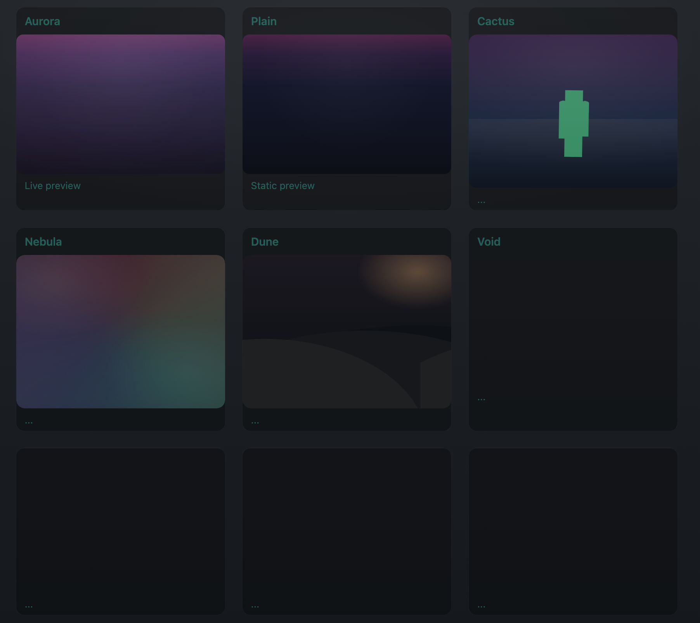

# Dev Blueprint 🌌

An ongoing project where I experiment with CSS and animations to create abstract, artistic designs.  
Each “canvas” in the gallery represents a standalone concept — ranging from subtle gradients to more vivid, animated backgrounds.

### Concept
- Exploring **CSS as a form of art**
- Experimenting with color, light, and motion
- Building a catalog of visual concepts that may inspire future projects
